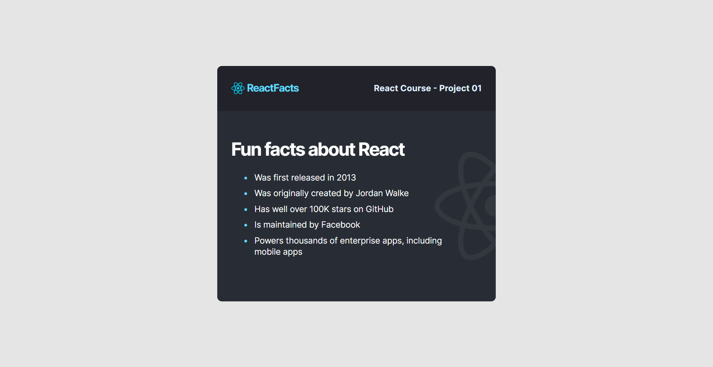
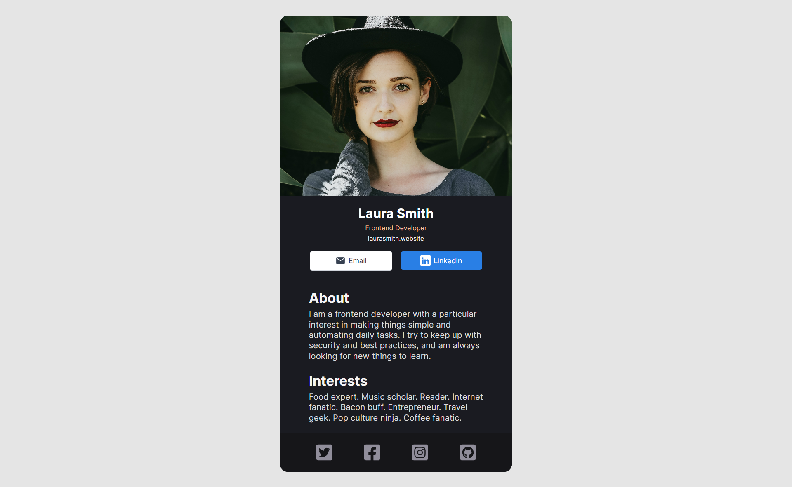

## Projects on React from Scrimba course

Learning React by building eight real-world projects and solving 140+ coding challenges.
[Free React course on Scrimba](https://scrimba.com/learn/learnreact)

[React](https://reactjs.org/) is one of the most popular front-end JavaScript libraries for building user interfaces.

✏️ This teacher is [Bob Ziroll](https://twitter.com/bobziroll), Head of Education at [Scrimba](https://scrimba.com/).

### Eight react projects:

- React Info Site

  - [Source Code](./react-info-site)
  - Preview Image
    

- Digital Business Card
  - [Source Code](./digital-business-card)
  - Preview Image
    
-
-
-
-
-
-
