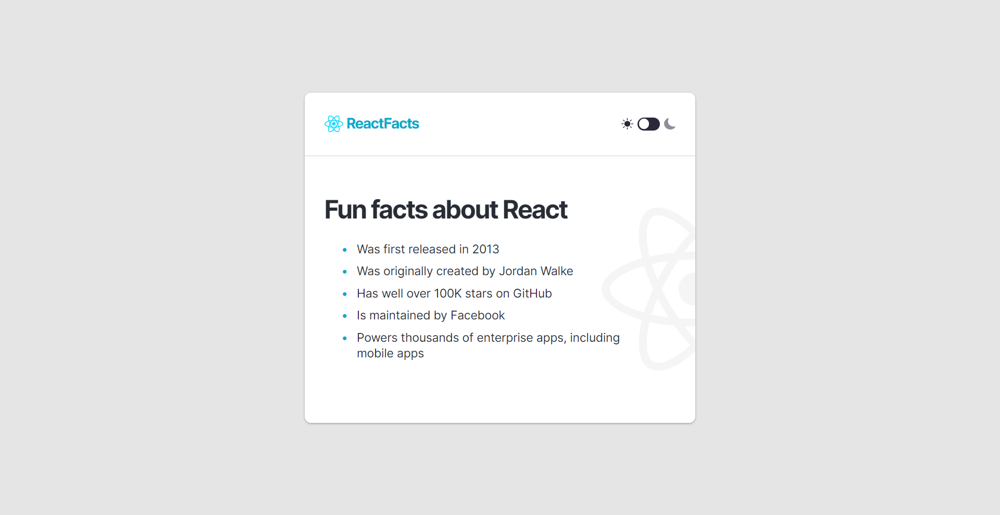
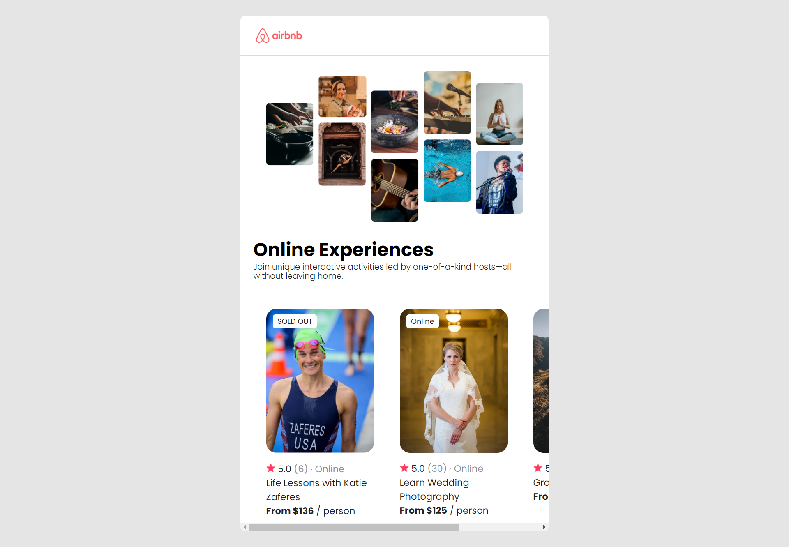
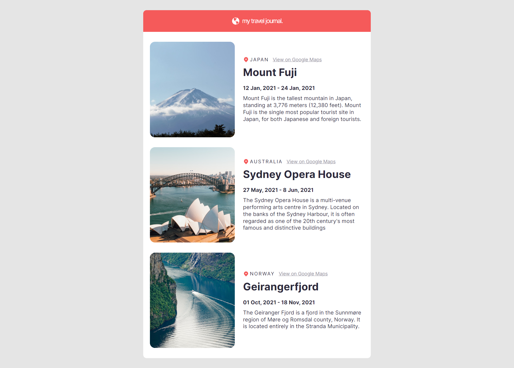
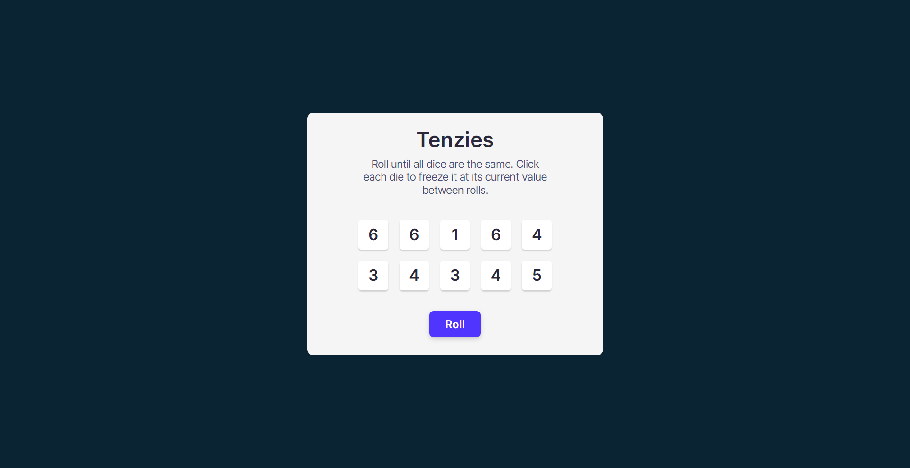

## Projects on React from Scrimba course

Learning React by building real-world projects and solving 140+ coding challenges.
[Free React course on Scrimba](https://scrimba.com/learn/learnreact)

[React](https://reactjs.org/) is one of the most popular front-end JavaScript libraries for building user interfaces.

✏️ The teacher is [Bob Ziroll](https://twitter.com/bobziroll), Head of Education at [Scrimba](https://scrimba.com/).

### React projects:

1.  #### [React Info Site](./react-info-site)
       
    [Source Code](./react-info-site/src/)
    

---

2.  #### [Digital Business Card](./digital-business-card)
       
    [Source Code](./digital-business-business/src/)
    

---

3.  #### [Airbnb Experiences](./airbnb-experiences)
       
    [Source Code](./airbnb-experiences/src/)
    

---

4.  #### [Travel Journal](./travel-journal)
       
    [Source Code](./travel-journal/src/)
    

---

5.  #### [Meme Generator](./meme-generator)
       
    [Source Code](./meme-generator/src/)
    

---

6.  #### [Tenzies Game](./tenzies-game)
       
    [Source Code](./tenzies-game/src/)
    

---

7.  #### [Quizzical App](./quizzical-app)
       
    [Source Code](./quizzical-app/src/)
    

---
