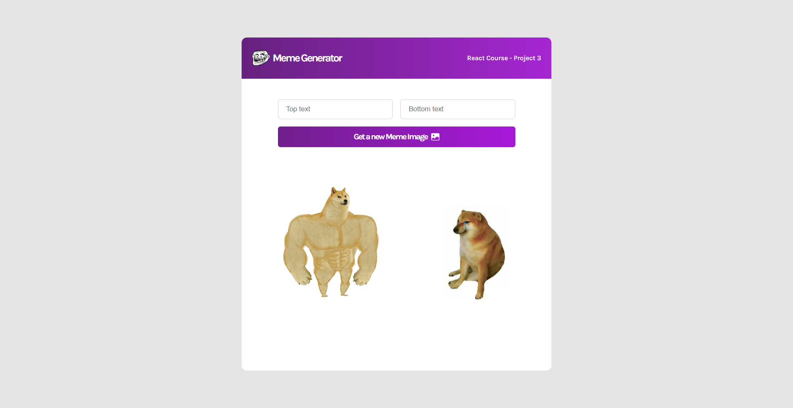

## Projects on React from Scrimba course

Learning React by building real-world projects and solving 140+ coding challenges.
[Free React course on Scrimba](https://scrimba.com/learn/learnreact)

[React](https://reactjs.org/) is one of the most popular front-end JavaScript libraries for building user interfaces.

✏️ The teacher is [Bob Ziroll](https://twitter.com/bobziroll), Head of Education at [Scrimba](https://scrimba.com/).

### React projects:

1. **React Info Site**
    
   [Source Code](./react-info-site)
   

   ***

2. **Digital Business Card**
    
   \- [Source Code](./digital-business-card)
   

   ***

3. **Airbnb Experiences**
    
   \- [Source Code](./airbnb-experiences)
   

   ***

4. **Travel journal**
    
   \- [Source Code](./travel-journal)
   

   ***

5. **Meme Generator**
    
   \- [Source Code](./meme-generator)
   

   ***

6. **Tenzies Game**
    
   \- [Source Code](./tenzies-game)
   

   ***

7. **Quizzical App**
    
   \- [Source Code](./quizzical-app)
   

   ***
